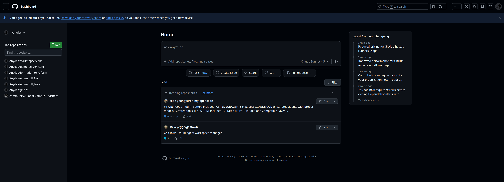
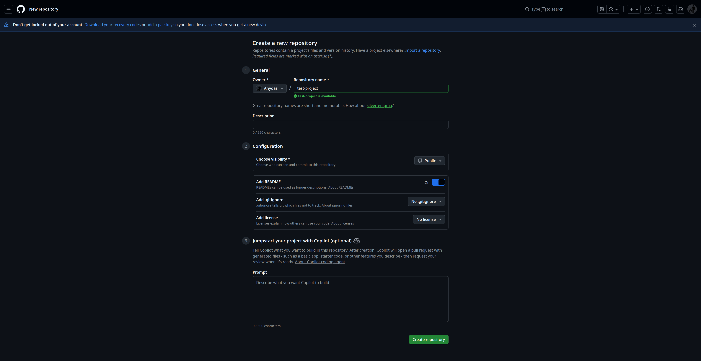
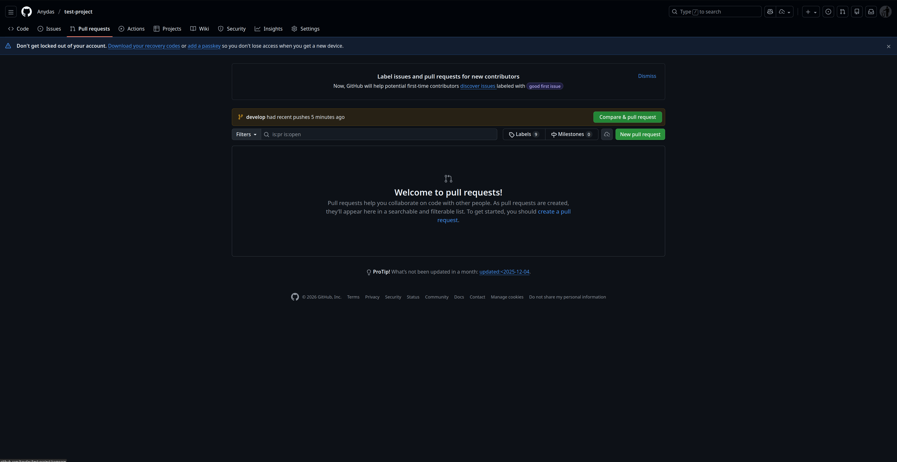
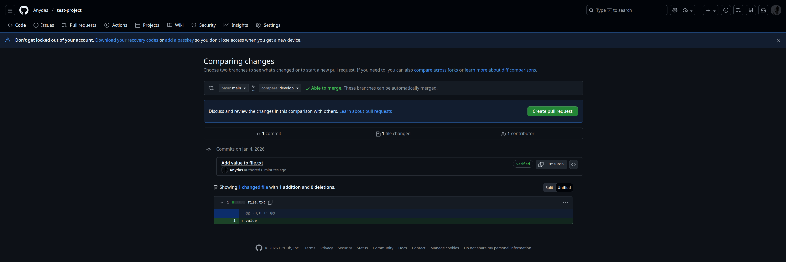
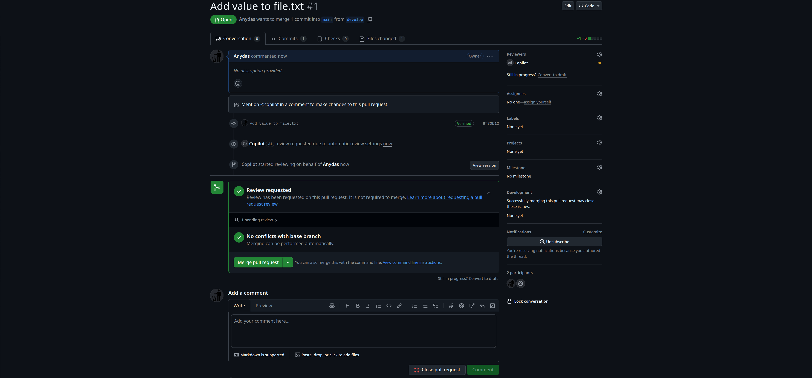

TP Git

Durée: 3h

Objectifs
- Comprendre les concepts fondamentaux de Git: historique, branches, fusion, remote.
- Savoir initier un dépôt, faire des commits, créer/merger des branches et résoudre des conflits.
- Utiliser un dépôt distant simple (bare) et gérer l'historique (amend, rebase, reset).

Pré-requis
- utiliser une machine virtuelle linux
- Avoir `git` installé.
- Un terminal et un éditeur de texte (vim, nano, VS Code...).

Configuration initiale (5 min)
1. Créez un dossier de travail et entrez dedans:

```bash
mkdir -p ~/git-tp1 && cd ~/git-tp1
git --version
```

2. Initialisez le dépôt et faites le premier commit:

```bash
git init
echo "# TP Git" > README.md
git add README.md
git commit -m "Initial commit: README"
git branch -M main
```

Déroulé et répartition
- Introduction et configuration: 5 min
- Exercice 1 — Commits simples: 15 min
- Exercice 2 — Branches locales: 15 min
- Exercice 3 — Merge & conflits: 20 min
- Exercice 4 — Remote local (bare) et push/pull: 15 min
- Exercice 5 — Amend & rebase: 10 min
- Exercice 6 — Travailler sur un repos distant: 10 min
- Exercice 7 — Réaliser une PR: 10 min
- Exercice 8 — Utilisation de github desktop: 1 heure

**Exercice 1** — Commits simples (15 min)
Objectif: Faire plusieurs commits significatifs et naviguer dans l'historique.

Étapes:
```bash
echo "print('hello')" > hello.py
git add hello.py
git commit -m "Add hello.py with hello print"
echo "print('bye')" >> hello.py
git add hello.py
git commit -m "Append bye to hello.py"
```

Vérifier l'historique:
```bash
git log --oneline --graph --decorate -n 5
```

Indice: utilisez `git show <commit>` pour voir le contenu d'un commit.


**Exercice 2** — Branches locales (20 min)
Objectif: Créer une branche, y travailler, puis revenir sur `main`.

Étapes:
```bash
git checkout -b feature-x
echo "# Feature X" > feature.txt
git add feature.txt
git commit -m "Start feature X"
git checkout main
git merge feature-x
```

Vérifier les branches:
```bash
git branch --all
git log --oneline --graph --all
```

Indice: si vous voulez conserver la branche après le merge, notez que `git branch -d feature-x` la supprimera si merge effectué.

**Exercice 3** — Merge et résolution de conflits (20 min)
Objectif: Créer un conflit volontaire, apprendre à le résoudre.

Étapes:
```bash
# partir de main
git checkout -b conflict-branch
echo "ligne A" > conflict.txt
git add conflict.txt
git commit -m "Add conflict file (branch)"
git checkout main
echo "ligne B" > conflict.txt
git add conflict.txt
git commit -m "Add conflict file (main)"
git merge conflict-branch
```

Vous verrez un conflit. Pour résoudre:
```bash
# éditez conflict.txt, choisissez le contenu voulu
git add conflict.txt
git commit -m "Resolve conflict between main and conflict-branch"
```

Indice: `git status` montre les fichiers en conflit; `git mergetool` peut aider.

**Exercice 4** — Remote local (bare) et push/pull (15 min)
Objectif: Configurer un dépôt distant local (bare) et pousser/puller.

Étapes (local remote):
```bash
# depuis le dossier parent
mkdir -p ../git-tp1-remote.git
cd ../git-tp1-remote.git
git init --bare
cd -
git remote add origin ../git-tp1-remote.git
git push -u origin main
```

Sur un autre clone (simuler un collègue):
```bash
git clone ../git-tp1-remote.git ../git-tp1-clone
cd ../git-tp1-clone
git checkout main
```

Indice: `--bare` crée un dépôt sans working tree, idéal pour simuler un remote local.

**Exercice 5** — Amend, rebase interactif et nettoyage (10 min)
Objectif: Corriger le dernier commit, réordonner/squasher des commits.

Étapes pour amend:
```bash
echo "/* fix */" >> hello.py
git add hello.py
git commit --amend --no-edit
```

Exemple de rebase interactif (réécrire les deux derniers commits):
```bash
git rebase -i HEAD~2
# puis marquer `squash` ou `reword` selon besoin
```

Indice: évitez de rebase des commits déjà poussés sur un remote partagé sans coordination.

**Exercice 6** — Travailler sur un repo distant (10 min)
Objectif: être capable d'effectuer des opérations sur un repo distant.

Pre-requis: un compte actif sur github 

Creer un nouveau projet public sur github:



Appuyer sur le bouton "new" puis remplir les champs comme ci dessous:



Copier l'url dans CODE => Local => HTTPS

Dans un nouveau repertoire sur votre poste, executer la commande suivante:

```bash
git clone URL_COPIEE
```

Creer un nouvelle branche develop et creer un nouveau fichier file.txt
Executer la commande suivante pour creer et remplir le fichier 
```bash
echo "develop" > file.txt
```

Effectuer un commit puis pusher la nouvelle branch:
```bash
git add file.txt
git commit -m "new develop branch"
git push origin develop
```
Retourner sur la branch main et creer de la même façon un fichier main.txt
Push ce fichier sur le repos distant comme vu precedement.

**Exercice 7** — Réaliser une pull request (10 min)
Objectif: être capable de réaliser une pull request

Pull request: propositions pour intégrer les modifications de code dans un projet. La pull request est soumise aux autres membres du projet afin de réaliser une relecture de code avant le merge definitif dans la branche principale du projet

Pour creer une merge request, rendez vous sur l'interface web de votre projet sur github et dans l'onglet Pull Requests cliquer sur "New pull request":



Dans Compare branch, selectionner Base: Main et compare develop pour reccuperer nos modification sur develop et les intégrer à main.



Vous verrez ensuite l'ensemble des fichiers et différences entre les deux branches. Il faudra ensuite appuyer sur Create pull request.

Une fois les potentiels conflits resolus, appuyer sur "Merge pull request" puis "confirm merge":



Dans le cas où vous souhaitez refuser une pull request, il vous suffit d'appuyer sur "close pull request" au lieu de "Merge pull request".

**Exercice 8** — Utilisation de github desktop (1 heure)
Objectif: être capable de réaliser des opérations basiques sur git via une interface graphique

__La suite du tp est à réaliser sur windows__

Dans un premiers temps, télécharger et installer : https://desktop.github.com/download/

Recommencer les exercices 1 à 3 et 5 à 6 avec GitHub desktop

Annexe — Commandes utiles (cheat-sheet)
- `git status` — état du working tree
- `git add <file>` — stage
- `git commit -m "msg"` — commit
- `git checkout -b <branch>` — créer/aller sur une branche
- `git merge <branch>` — fusionner
- `git rebase -i HEAD~N` — réécrire l'historique
- `git stash` — sauvegarder modifications non committées
- `git reset --hard <ref>` — revenir à une référence (attention perte de données)

